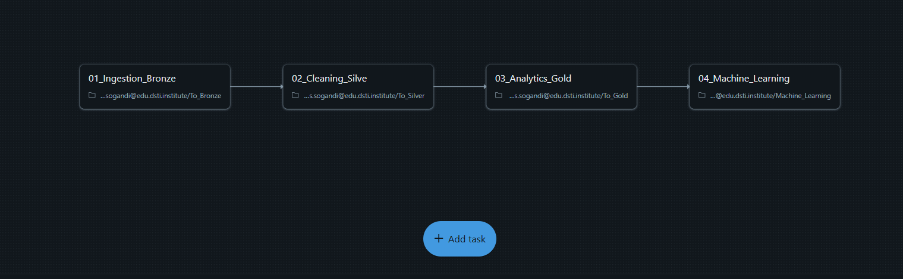
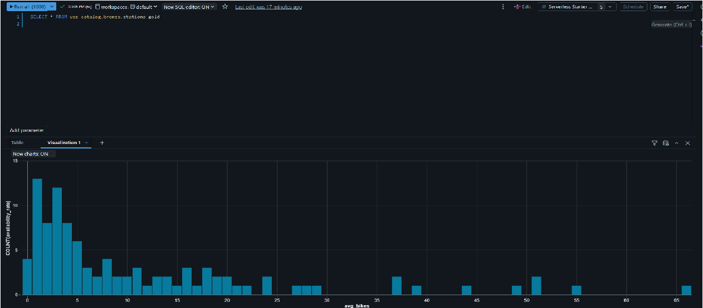
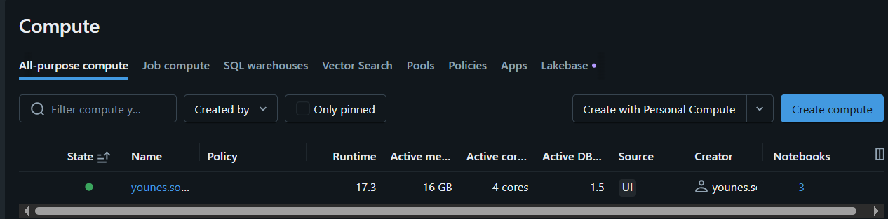

# Vélib Real-Time Data Pipeline & ML Forecaster

[](https://azure.microsoft.com/)
[](https://databricks.com/)
[](https://spark.apache.org/)

##  Project Overview
This project implements an end-to-end **Cloud Data Lakehouse** using the **Medallion Architecture**. It ingests real-time bike-sharing data from the Paris Vélib API, processes it through Bronze, Silver, and Gold layers, and concludes with a Machine Learning model to predict bike availability.

### Key Features:
* **Hybrid Ingestion:** Combines static configuration data (`cities.csv` from Azure Blob Storage) with real-time JSON API telemetry.
* **Schema Evolution:** Implemented Delta Lake `mergeSchema` to handle dynamic API updates without pipeline failure.
* **Predictive Analytics:** Linear Regression model trained to forecast bike availability based on station capacity and temporal features.
* **Automated Workflows:** Designed for orchestration via Azure Data Factory (ADF) and Databricks Jobs.

---

##  Architecture
The pipeline follows the industry-standard Medallion layers:



##  Business Insights
The Gold layer provides actionable insights into bike availability trends across the network.



##  Infrastructure
* **Compute:** Single-node cluster, 16GB Memory, 4 Cores.
* **Runtime:** Databricks Runtime 17.3 (Spark 3.5.0).



1.  **Bronze (Raw):** Append-only landing zone for raw JSON API responses. Includes `ingestion_time` for historical tracking.
2.  **Silver (Cleaned):** Data is flattened (nested coordinates extracted), type-casted, and filtered for quality (null removal).
3.  **Gold (Aggregated):** Business-level tables calculating average availability rates per station.
4.  **ML Layer:** A Spark MLlib pipeline that transforms features and trains a regressor.

---

##  Tech Stack
* **Orchestration:** Azure Databricks, Azure Data Factory (planned).
* **Storage:** Azure Data Lake Storage Gen2 (ADLS), Delta Lake.
* **Processing:** PySpark (Spark SQL & MLlib), Pandas.
* **API:** Paris Open Data (Vélib Real-time).

---

##  Getting Started

### Prerequisites
* Azure Subscription with a Databricks Workspace.
* An Azure Storage Account with a container named `raw-data`.
* Upload `cities.csv` to the container.

### Installation & Execution
1.  **Storage Setup:** Configure your storage keys in the first cell of the notebook:
    ```python
    spark.conf.set("fs.azure.account.key.<your_storage_account>.blob.core.windows.net", "<your_access_key>")
    ```
2.  **Pipeline Run:**
    * Execute **Ingestion** to fetch API data into `bronze_stations`.
    * Execute **Transformation** to generate the `silver_stations` table.
    * Execute **ML Training** to generate predictions.

---

##  Model Performance
The Machine Learning model utilizes `capacity`, `hour`, and `day_of_week` as features.

* **Algorithm:** Linear Regression
* **Evaluation Metric:** RMSE (Root Mean Squared Error)
* **Current Result:** ~8.33
* **Interpretation:** The model predicts station occupancy within an average margin of 8 bikes.

---

##  Future Roadmap (Data Factory Integration)
To move this into a production environment, the following "Data Factory" standards are planned:
* **CI/CD:** Automating notebook deployments via GitHub Actions.
* **Monitoring:** Integrating Azure Monitor to alert on pipeline failures.
* **MLflow:** Registering the model in a centralized registry for versioning and staging.

---

##  Repository Structure
```text
├── notebooks/
│   ├── 01_Ingestion_Bronze.py  # API to Delta
│   ├── 02_Cleaning_Silver.py   # Data Quality & Flattening
│   ├── 03_Analytics_Gold.py    # Business Aggregations
│   └── 04_Machine_Learning.py  # Spark ML Pipeline
├── data/
│   └── cities.csv              # Static lookup configuration
└── README.md
